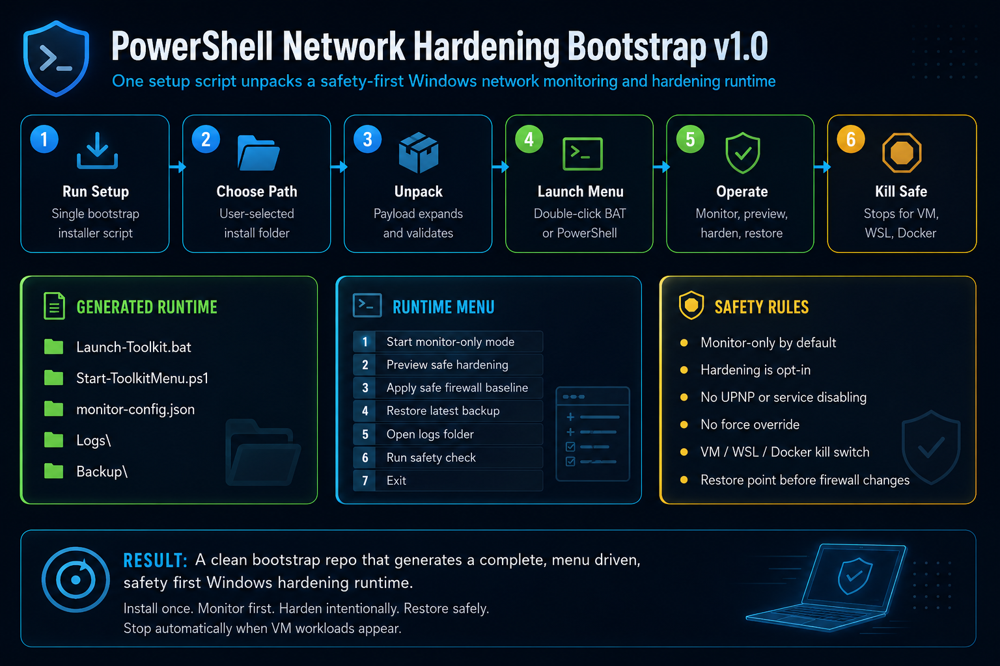

# PowerShell Network Hardening Bootstrap (Bootstrap System)

<p align="center">
  
</p>

<p align="center">
  
  
  
  
</p>

---

# Important Concept

PowerShell Network Hardening Bootstrap is a bootstrap / unpacker engine. You run one setup script, choose where to install, and it generates the complete Windows network monitoring and hardening runtime.

The bootstrap is for installation. The generated runtime scripts are for daily use.

---

# Only Entry File

```powershell
.\PowerShell_Network_Hardening_Bootstrap_Setup.ps1
```

The bootstrap:

- Asks where to install the toolkit.
- Blocks unsafe Windows system install locations.
- Unpacks the complete runtime payload.
- Generates config, folders, scripts, logs, backups, and runtime docs.
- Validates generated PowerShell and JSON files.
- Fails clearly if generation fails.
- Prints the launch command when complete.

---

# Generated System

Default install path:

```text
C:\PowerShell-Network-Hardening-Bootstrap\
|-- Launch-Toolkit.bat
|-- Start-ToolkitMenu.ps1
|-- Bootstrap-WindowsHardeningToolkit.ps1
|-- Start-WindowsHardeningToolkit.ps1
|-- Restore-WindowsHardeningToolkit.ps1
|-- monitor-config.json
|-- README.md
|-- LICENSE
|-- Backup\
`-- Logs\
```

---

# Installation

Open PowerShell:

```powershell
cd <REPO_FOLDER>
.\PowerShell_Network_Hardening_Bootstrap_Setup.ps1
```

Follow the prompt to choose the install folder.

---

# Daily Operation

Double-click in the generated folder:

```text
Launch-Toolkit.bat
```

Or open PowerShell as Administrator:

```powershell
cd C:\PowerShell-Network-Hardening-Bootstrap
.\Start-ToolkitMenu.ps1
```

That opens the runtime menu:

```text
1. Start monitor-only mode
2. Preview safe hardening changes
3. Apply safe firewall baseline
4. Restore latest backup
5. Open logs folder
6. Run safety check
7. Exit
```

---

# Direct Commands

Start monitoring without the menu:

```powershell
.\Bootstrap-WindowsHardeningToolkit.ps1
```

Preview hardening without changing anything:

```powershell
.\Start-WindowsHardeningToolkit.ps1 -ApplyHardening -WhatIf
```

Apply the safe firewall baseline:

```powershell
.\Bootstrap-WindowsHardeningToolkit.ps1 -ApplyHardening
```

Restore latest saved firewall state:

```powershell
.\Restore-WindowsHardeningToolkit.ps1
```

---

# Runtime Output

```text
C:\PowerShell-Network-Hardening-Bootstrap\Logs\
C:\PowerShell-Network-Hardening-Bootstrap\Backup\
```

Logs track monitoring events and kill-switch exits. Backup stores restore points created before firewall changes.

---

# Safety Layer

- Admin expected for hardening and restore actions.
- Monitor-only is the default behavior.
- Hardening is opt-in from the menu.
- No UPnP/service-disabling actions are included.
- No force override exists.
- Hardening stops when VM, WSL, Docker, VPN-style adapters, or virtual networking indicators are detected.
- Runtime monitoring exits if a VM, WSL, or Docker workload starts.
- Restore points are created before firewall changes.

---

# Status

Safety-First Bootstrap System v1.0

---

# Author

TCDOverLord
