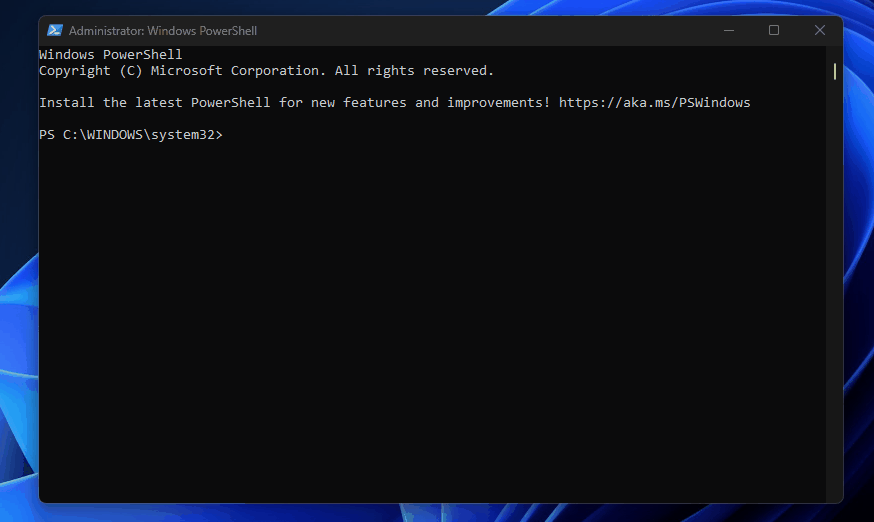

<p align="center">
  
  
  
  
</p>

# Windows Hardening Toolkit

Windows Hardening Toolkit is a defensive PowerShell utility for monitoring new TCP activity and optionally applying a conservative Windows firewall baseline. It is designed for labs, personal workstations, and administrator review workflows where readable logs, rollback, and simple configuration matter.



## What It Does

- Monitors by default without changing firewall or service settings.
- Optionally enables Windows Firewall for Domain, Private, and Public profiles.
- Optionally sets inbound traffic to block by default and outbound traffic to allow by default.
- Creates a restore point before applying hardening changes.
- Refuses hardening when VM, WSL, Docker, or virtual networking activity is detected.
- Exits during monitoring if a VM, WSL, or Docker workload starts.
- Adds duplicate-safe outbound allow rules for Chrome and Microsoft Edge when installed.
- Monitors new TCP connections and listening ports.
- Classifies activity as LOW, MEDIUM, or HIGH risk.
- Supports process whitelisting, ignored IPs, high-risk ports, logs, and optional pop-up alerts.

## Repository Layout

```text
windows-hardening-toolkit/
|-- Bootstrap-WindowsHardeningToolkit.ps1
|-- Start-WindowsHardeningToolkit.ps1
|-- Restore-WindowsHardeningToolkit.ps1
|-- monitor-config.json
|-- README.md
|-- LICENSE
`-- windows-hardening-toolkit-demo.gif
```

## Requirements

- Windows 10 or Windows 11
- PowerShell 5.1 or newer
- Administrator PowerShell session

## Quick Start

Open PowerShell as Administrator, then run in monitoring-only mode:

```powershell
cd "C:\GitHub_Backups\tcdoverlord\windows-hardening-toolkit"
.\Bootstrap-WindowsHardeningToolkit.ps1
```

Apply the firewall baseline only when no VM/virtual networking activity is detected:

```powershell
.\Bootstrap-WindowsHardeningToolkit.ps1 -ApplyHardening
```

Run without pop-up alerts:

```powershell
.\Bootstrap-WindowsHardeningToolkit.ps1 -NoAlerts
```

Change the monitoring interval:

```powershell
.\Bootstrap-WindowsHardeningToolkit.ps1 -MonitorIntervalSeconds 10
```

You can also run the main script directly:

```powershell
.\Start-WindowsHardeningToolkit.ps1
```

Preview hardening changes without applying them:

```powershell
.\Start-WindowsHardeningToolkit.ps1 -ApplyHardening -WhatIf
```

Restore the latest saved firewall/service state:

```powershell
.\Restore-WindowsHardeningToolkit.ps1
```

Restore from a specific restore point:

```powershell
.\Restore-WindowsHardeningToolkit.ps1 -RestorePointPath ".\Backup\RestorePoint_20260618_173000.json"
```

## Configuration

The toolkit reads settings from [monitor-config.json](monitor-config.json).

```json
{
  "Whitelist": [
    "chrome",
    "msedge",
    "firefox",
    "explorer",
    "svchost",
    "system"
  ],
  "IgnoredIPs": [
    "127.0.0.1",
    "::1",
    "0.0.0.0"
  ],
  "HighRiskPorts": [
    4444,
    1337,
    5555,
    6666,
    8081
  ]
}
```

## Generated Folders

The script creates these folders inside the repository at runtime:

```text
Logs/
Backup/
```

Logs are named with a timestamp, for example:

```text
Logs/PortLog_20260618_173000.txt
```

Restore points are created before hardening changes:

```text
Backup/RestorePoint_20260618_173000.json
```

## Risk Classification

| Level | Trigger |
| --- | --- |
| LOW | Routine TCP activity that does not match a higher-risk rule. |
| MEDIUM | New established, SYN sent, or SYN received connections. |
| HIGH | New listening ports or ports listed in `HighRiskPorts`. |

## Safety Notes

- Review `monitor-config.json` before running the toolkit.
- Test in a non-production environment before using on critical systems.
- The default bootstrap command monitors only and does not change firewall or service settings.
- Use `-ApplyHardening` only after reviewing the expected impact.
- Hardening has no force override. It stops itself when Hyper-V, VMware, VirtualBox, WSL, Docker, VPN-style adapters, or other virtual networking indicators are detected.
- Runtime monitoring also exits if a VM, WSL, or Docker workload starts after the toolkit is already running.
- Stop VM/WSL/Docker workloads before applying hardening on a host machine.
- Do not whitelist unknown processes just to silence alerts.
- Keep Windows Firewall enabled while using the toolkit.

## Project Goals

This project demonstrates practical Windows administration with native tooling:

- PowerShell automation
- Windows Firewall management
- Network activity monitoring
- Defensive logging
- Configuration-driven security workflows

## Author

**TCDOverLord**

GitHub: [tcdoverlord](https://github.com/tcdoverlord)

## Disclaimer

This project is intended for educational, defensive security, and system administration purposes. Review the code and configuration before running it on any system you rely on.
